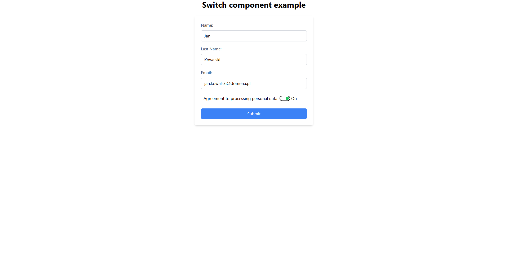

# Switch Component Example

A demonstration of a custom switch component implementation following W3C accessibility standards.

## Features

- Built with modern web development tools and frameworks
- Follows W3C ARIA design patterns for switches
- Type-safe implementation using TypeScript
- Form validation with Zod
- Created using Vite build tool

## Technical Stack

The project leverages a robust set of technologies:

- **[Vite](https://vitejs.dev/)**: The Build Tool for the Web
- **[React](https://react.dev/)**: The library for web and native user interfaces
- **[TypeScript](https://www.typescriptlang.org/)**: Static type checking
- **[Zod](https://zod.dev/)**: Schema validation library
- **[Tailwind CSS](https://tailwindcss.com/)**: A utility-first CSS framework for rapid UI development

## Accessibility

This component implements the official W3C ARIA switch pattern, ensuring:

- Proper keyboard navigation
- Screen reader compatibility
- Semantic HTML structure
- ARIA states and properties

## References

Based on official W3C documentation and examples:

- [Switch Pattern Specification](https://www.w3.org/WAI/ARIA/apg/patterns/switch/)
- [Official W3C Implementation Example](https://www.w3.org/WAI/ARIA/apg/patterns/switch/examples/switch/)

## Screen

